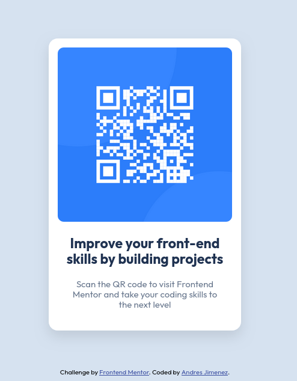

# Frontend Mentor - QR code component solution

This is a solution to the [QR code component challenge on Frontend Mentor](https://www.frontendmentor.io/challenges/qr-code-component-iux_sIO_H). Frontend Mentor challenges help you improve your coding skills by building realistic projects. 

## Table of contents

- [Overview](#overview)
  - [Screenshot](#screenshot)
  - [Links](#links)
- [My process](#my-process)
  - [Built with](#built-with)
  - [What I learned](#what-i-learned)
  - [Continued development](#continued-development)
- [Author](#author)

## Overview

### Screenshot

### Links

- Solution URL: [https://github.com/andresj24/qr_code_component](https://github.com/andresj24/qr_code_component)
- Live Site URL: [https://qrcodecomponent-aj.netlify.app/](https://qrcodecomponent-aj.netlify.app/)

## My process

### Built with

- Semantic HTML5 markup
- CSS custom properties
- Flexbox

### What I learned

I selected this project to resume my preparation in web development and programming after having abandoned it for a few years.

In this project I was able to review basic concepts related to HTML5 and CSS, among them: HTML tags, content structuring, selectors and classes to edit styles and in this way obtain a result that is as similar as possible to the proposed design.

### Continued development

Soon I will continue working on projects of this type to continue practicing the fundamentals and later I will select more complex projects that include the use of the JavaScript language, database, and more, until I create a complete web application.

## Author

- Frontend Mentor - [@andresj24](https://www.frontendmentor.io/profile/andresj24)
- Twitter - [@AndresitoJ96](https://x.com/AndresitoJ96)

